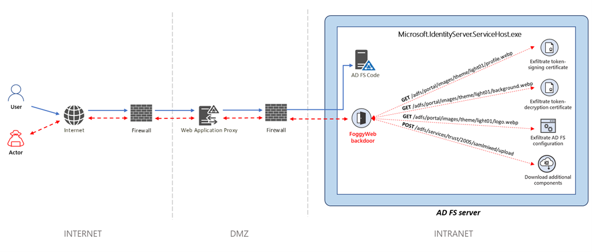
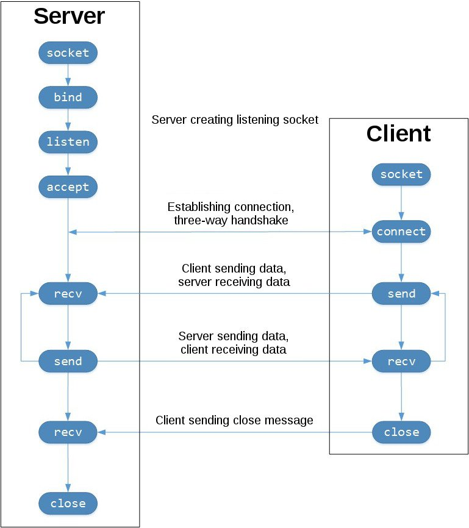
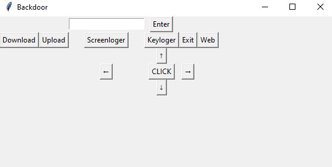

# Вступление
Проект создан исключительно для образовательных целей: 
* изучения сетей;
* изучить особенность межсетевых экранов;
* знакомство с такими библиотеками как: socket, threading, keyboard, Pillow, tkinter, Pillow и др.; 
* освоение основ python.
#### Проект не использовался в злоумышленной деятельности!!!

# Что такое Backdoor

Backdoor – это программа, основным назначением которой является скрытное управление компьютером. Backdoor можно условно подразделить на следующие категории:

Backdoor, построенные по технологии Client – Server. Такой Backdoor состоит как минимум из двух программ – небольшой программы, скрытно устанавливаемой на поражаемый компьютер и программы управления, устанавливаемой на компьютер злоумышленника. Иногда в комплекте идет еще и программа настройки
Backdoor, использующие для удаленного управления встроенный telnet, web или IRC сервер. Для управления таким Backdoor не требуется специальное клиентское программное обеспечение. К примеру, я как-то исследовал Backdoor, который подключался к заданному IRC серверу и использовал его для обмена со злоумышленником.
Основное назначение Backdoor – скрытное управление компьютером. Как правило, Backdoor позволяет копировать файлы с пораженного компьютера и наоборот, передавать на пораженный компьютер файлы и программы. Кроме того, обычно Backdoor позволяет получить удаленный доступ к реестру, производить системные операции (перезагрузку ПК, создание новых сететвых ресурсов, модификацию паролей и т. п.) . Backdoor по сути открывает атакующему «черный ход» на компьютер пользователя. Опасность Backdoor увеличилась в последнее время в связи с тем, что многие современные сетевые черви или содержат в себе Backdoor-компоненту, или устанавливают ее после заражения ПК. Второй особенностью многих Backdoor программ является то, что они позволяют использовать компьютер пользователя для сканирования сети, проведения сетевых атак взлома сетей – при этом попытки взлома ведутся с ничего не подозревающего компьютера пользователя.

# Сокеты в пайтон

С помощью socket.socket() вы создадите объект сокета с указанием типа сокета socket.SOCK_STREAM. При этом по умолчанию применяется протокол управления передачей (TCP). Возможно, это то, что вам нужно.

Но зачем вам TCP? Вот его особенности:

TCP надёжен. Отброшенные в сети пакеты обнаруживаются и повторно передаются отправителем.
Данные доставляются с сохранением порядка очерёдности. В приложении данные считываются в порядке их записи отправителем.

Для сравнения: сокеты, которые создаются через socket.SOCK_DGRAM протокола пользовательских датаграмм ненадёжны: данные могут считываться получателем с изменением порядка очерёдности записей отправителя. Почему это важно? Сети — это система негарантированной доставки. Нет гарантии, что данные дойдут до места назначения или что отправленные данные будут получены.

Сетевые устройства — маршрутизаторы и коммутаторы — также обладают конечной полосой пропускания и собственными, системными ограничениями. Как на клиентах и на серверах, у них есть процессоры, память, шины и интерфейсные буферы пакетов. С TCP при этом не нужно беспокоиться о потере пакетов, поступлении данных с изменением порядка очерёдности пакетов данных, а также о других подводных камнях.

Чтобы разобраться лучше, ознакомьтесь с последовательностью вызовов API сокетов и с потоком данных TCP.

Ниже слева сервер, а справа клиент:

Поток TCP-сокетов
Поток TCP-сокетов. В центре изображения показан обмен данными между клиентом и сервером с помощью вызовов .send() и .recv().

Внизу соответствующие сокеты закрываются на клиенте и на сервере. (источник изображения)

Начиная с верхнего левого угла, показаны серверные вызовы API на сервере, которые настраивают «прослушиваемый» сокет:

socket()
.bind()
.listen()
.accept()

Этим сокетом, как следует из его названия, прослушиваются подключения от клиентов. Чтобы принять или завершить такое подключение, на сервере вызывается .accept().

А чтобы установить подключение к серверу и инициировать трёхэтапное рукопожатие, на клиенте вызывается .connect(). Процесс рукопожатия важен, ведь он гарантирует доступность каждой стороны подключения в сети, то есть то, что клиент может связаться с сервером, и наоборот. Возможно, только один хост, клиент или сервер может связаться с другим.
# Меню

* Для того, чтобы загрузить или скачать файл, нужно сначало ввести название самого файла.
* Кнопка "WEB" открывает сайт в дефолтном браузере, для этого нужно ввести url странички. 
* Стрелки управляет поведением мышки на другом компьютере. 